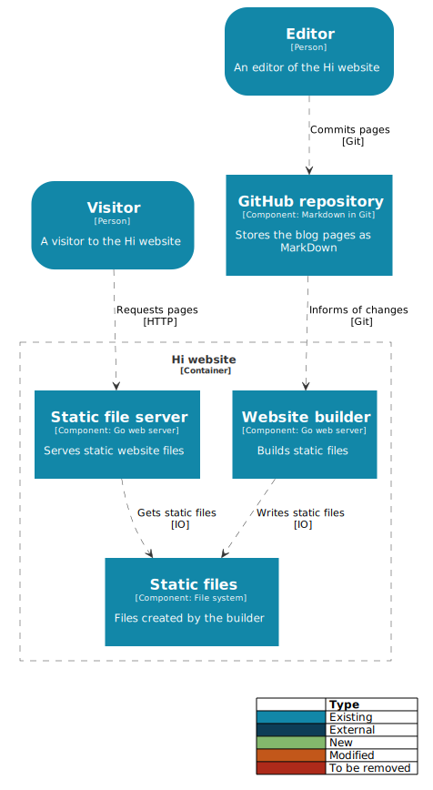

# Hi

A developer-friendly blog engine, written in Go, driven by GitHub.

## To Do

### Features

- [x] Serve static files
- [ ] Add GitHub hook to notify of changes
- [ ] Define post Markdown format
- [ ] Static page generation
  - [ ] Templates
  - [ ] Single pages
  - [ ] List pages (homepage, tags)
- [ ] Tests! (Probably to come later as I'm still learning Go)

### Development practices

- [ ] Should I copy the application to the root of my Docker image?
- [ ] Optimise Dockerfile - seems to be rebuilding when later layers are changed
- [ ] Understand the details of Go Modules
- [ ] Understand Go testing

## Future
- [ ] AMP support
- [ ] Micro browser support (https://24ways.org/2019/microbrowsers-are-everywhere/)
- [ ] Medium publishing
